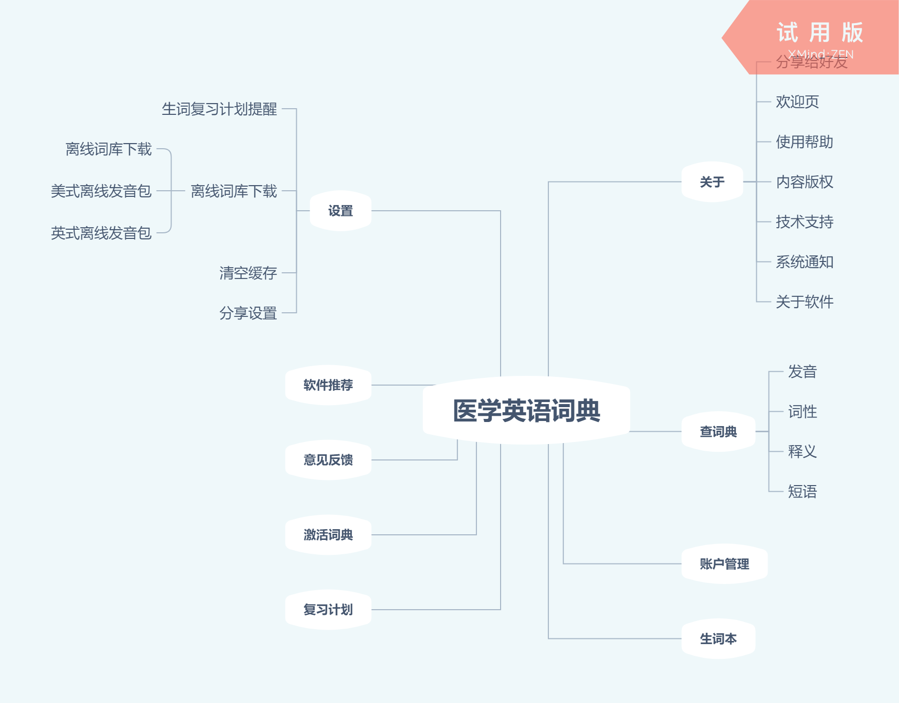
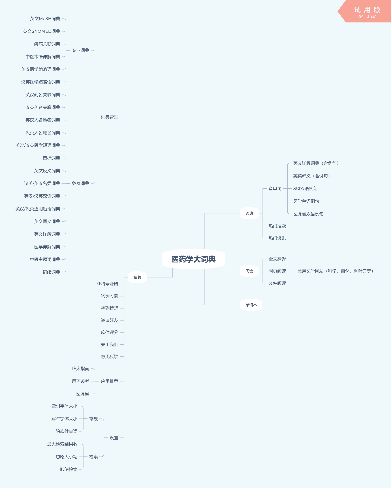

# 医学辞典
## 医学词典APP
医学辞典已经做成APP的有以下几个。
- 医学辞典

- 医药学大词典

- 外教社医学词汇手册

- 道兰氏图解医学词典

- 牛津简明医学辞典

- 湘雅医药学大词典
下面我们对于几个具有代表性的产品进行产品逻辑分析
## 医学辞典分析（产品逻辑图）

## 汉英医学辞典
**不同点**
- 词典编纂角度 
  从字典的编纂角度来看，医学辞典属于专业词典，与术语学的关系更大，而专业词典更多的是使用规定性语言，因为要实现对某一特定概念的“无歧义”，所以对于词汇的标准化是要求非常高的。而普通词典偏向于使用描述性语言。标准化与知识的关联更多，而与语言( language) 和话语 ( discourse) 的关联较少; 在语言 / 话语这对组合中，标准化与语言的关系更亲。这是因为我们“谈论”( speak about) 概念的方式是经常变化的，这些方式依赖于适合专家或者其他交谈者进行交流的不同语境。这种交流环境影响到术语作为话语单位( discourse unit) 的选择，但它并不影响交谈者正在谈论着的“概念”的稳定性。（邱碧华. 2017)
- 使用者角度
 使用医学辞典的多为译者和专业人员，他们使用医学词典的目的更多的侧重于词典对于概念的解释，而非传统字典的读音，搭配等方便。
- 词汇角度
   - 常用词异义
   医学英语中有大量的词汇来源于日常英语基本词汇。这些词汇并非专业医学词汇，但在医学英语中产生了词义变迁，表达着特殊医学含义，与常见词义截然不同。例如，“arrest ” 的普通含义为“逮捕”，其医学含义为“心脏骤停”；“culture”一词在医学英语中应译为“培养物”；“pupil ” 表达的特殊医学含义为“瞳孔”
   - 缩略词大量应用
   医学英语力求用简洁明了的方式传递信息，因而在现实生活中，缩略语被广泛使用。缩略语是按
   一定规则对原有的单词或词组加以提炼、浓缩，其表达形式主要有如下两种：①原词组中各词首字母缩略（Acronyms），如RBC = red blood cell 红细胞，DIC=disseminated inravascular coagulation弥散性血管内凝血；②取原词中主要字母或某一部分构成紧缩词（Abbreviation），如Hgb = hemoglobin血红蛋白、flu=influenza 流感。除此以外，学术团体、医疗服务机构也多用缩略语。如WHO（World Health Organization）世界卫生组织，ICU（Intensive Care Unit）重症监护病房等。
   - 收录了大量的领域内生僻词
   普通英语用“bone”表达“骨头”，而医学英语中就四肢的长骨而言，就有六种严格的划分：上臂的肱骨（humerus）、前臂内侧的尺骨（ulna）和外侧的桡骨（radius）；大腿的股骨（femur）、小腿内侧的胫骨（tibia）及外侧的腓骨（fibula）。另外，我们常说的肾炎，在医学英语中又被分为肾小球肾炎（ glomerular nephritis）、肾盂肾炎（pyelo nephritis）、肾小管肾炎（ tubular nephritis） 和间质性肾炎（interstitial nephritis）等。
- 对其中的一些相关的概念，给予了解释和图解
- 提供的专业论文的双语例句，来辅助译员理解原句
**相同点**
- 提供单词的音标
- 提供单词的基本释义

## 新功能展望
- 提供更加详实的解释（图解）来帮助译员理解原文
- 提供根据词根查找
希腊语和拉丁语词素是医学英语术语构成的关键要素，这是因为他们词性、词义单一固定，表达准确、客观，避免了同名异物或同物异名的错乱现象。同时，希腊语和拉丁语词源丰富，通过合成、派生、添加前后缀等方法使构词宽泛，不断孕育出浩如烟海的医学英语新词以描述复杂、微妙而又丰富多彩的医学概念和医学现象。
以“cardi( o) ”（希腊词源，意为“心、与心脏有关的”）开头的医学英语词汇为例，在《世界最新英汉医学辞典》1（白永权主编，2000）中就有接近150 个左右，甚至还可以扩展更多：cardiogram（心动图）= cardio + gram（图、图表）；cardiomyopathy（心肌病）= cardio + myo ( 希腊词素，意为“ 肌”) +pathy（希腊词素，意为“疾病”）；cardiotomy（心切开术）= cardio + tomy（希腊词素，意为“切开术”）。
- 提供不断更新的新词词库
据统计，每年新增的医学英语新词汇平均多达1500 个。
- 对容易出现歧义的单词，提供例句进行辨析。
例如，“complaint ”在句子“The travellers made a complaint about the weather today. ”中是“抱怨”的意思，而在“The patient came to the office with a chief complaint of a two-day history of dry cough. ”一句中的含义是“主诉”。

参考文献：
[1]邱碧华. (2017). 术语学和专业词典编纂学:两个相得益彰的领域. 中国科技术语, 19(4), 18-23.
[2]胡滨. (2011). 浅谈医学英语词汇的特点及学习技巧. 首都医科大学学报(社科版), 186-188.